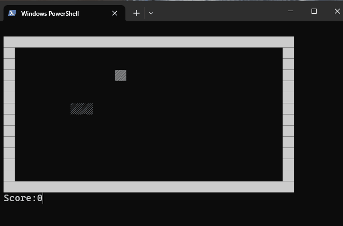

# Build Your Own Snake Game
This challenge is to build your own version of the classic game snake

## The Challenge
nake is a simple game. The player controls a snake which move around the playing grid at a fixed speed. The goal is to eat food that appears at random locations on the grid.

For each item of food eaten the snake becomes longer and the player scores points. The game ends when the snake hits the edge of the game grid or it’s own body.

## Solution

I decided to make the snake game in shell. Why? I don't like to code in frontend. You can use any gui tool or web tool. The main logic is the same.

### The Game Board
The game has some states: board, snake position, food position etc. At first configure how your board will look like and create the game state like that

### The snake
The snake will move towards the current direction. The direction can be changed by keyboard arrow keys. The snake moves is simple, add a new head to the fron, cut the tail.

### Collision Detection
If snake collides with food, it increases its length ie the tail isn't cut off. If it collides with itself or the wall (optional) then game ends. 