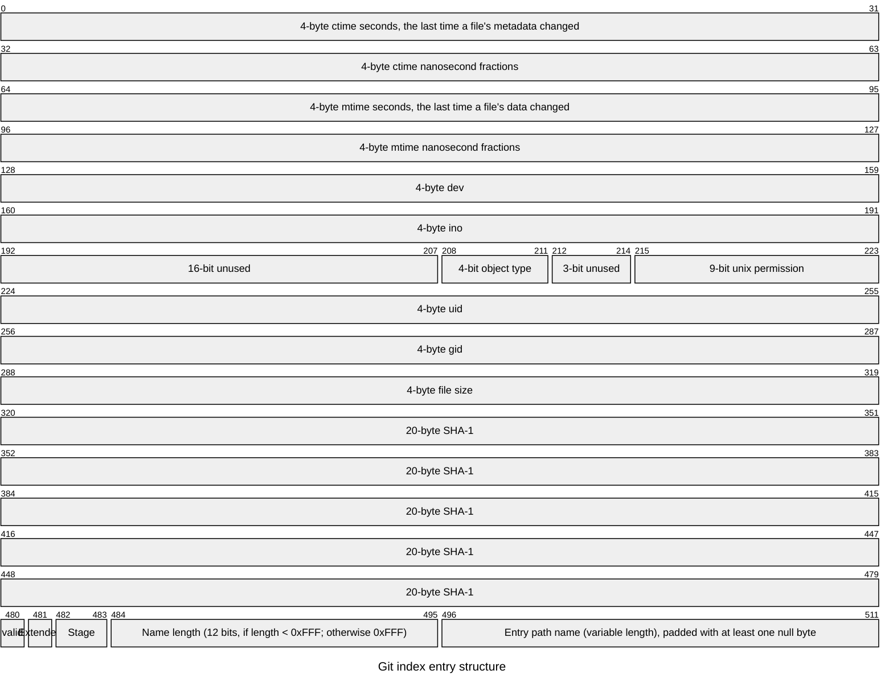

# Build Your Own Git
This one of my most challenging task ever. Here I will build a simple git or gitlet. It will be capable of adding files to index, commiting the changes and finally pushing to github. 

## Solution

### `git init`
The git init command simply creates some directory and files in the location specified. The directories and files in `.git` are
- `.git/objects/` : This folder saves the compressed version of the files
- `.git/branches/` :
- `.git/HEAD` : 
- `.git/config` :
etc. I will add the description to these as I move forward with the tasks.

### `git hash-object`: 
This command calculates the sha1 hash of the file provided. The data that is hashed is structured like 

```
<type> <size>x\00<content>
```
The type indicates the type of the object which is one of `blob` `commit` ``. The size is the actual size of the object. The hash-object is also used in other git commands too. We talk about it later. 

### `git add`

**Index Entry:**

Field	Size (bytes)
1. ctime (8 bytes): The last time a file's metadata changed.
1. mtime (8 bytes): The last time a file's data changed.
1. dev (4 bytes): Device number.
1. ino (4 bytes): Inode number.
1. mode (4 bytes): 2 byte empty, 4 bit object type, 3 bit unused, 9 bit permission.
1. uid (4 bytes): User ID of the owner.
1. gid (4 bytes): Group ID of the owner.
1. size (4 bytes): Size of the file in bytes.
1. SHA-1 (20 bytes): SHA-1 hash of the file's contents.
1. flags (2 bytes): Flags, including the length of the file path.
-------------------
62 byte  
file name with path null terminated  
the whole index then will be padded with at least one null byte to make multiple of 8


