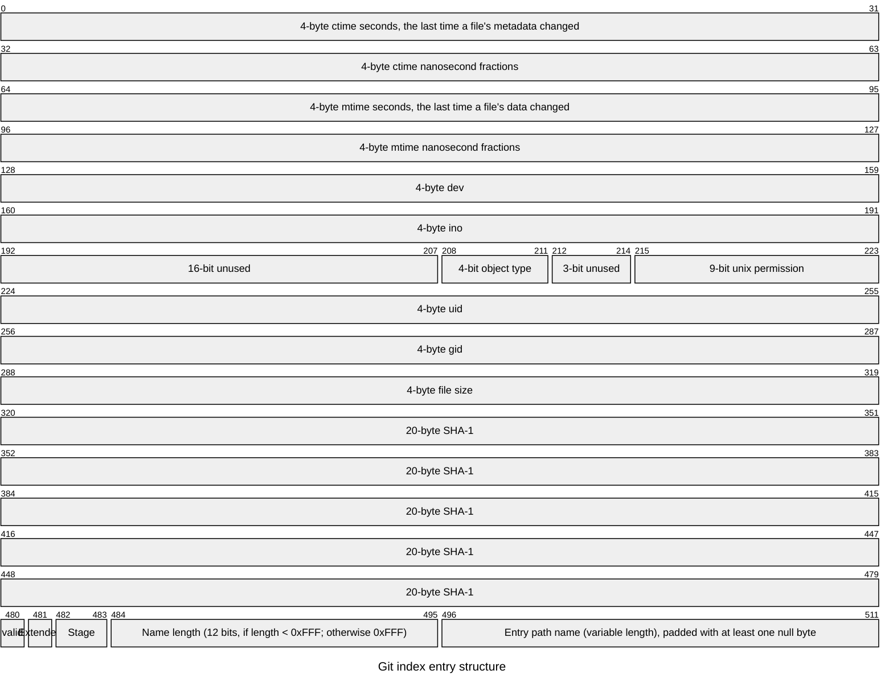

# Build Your Own Git
This one of my most challenging task ever. Here I will build a simple git or gitlet. It will be capable of adding files to index, commiting the changes and finally pushing to github. 


## Solution
> [!NOTE]
> The implementation has been relocated in its own repository [TamimEhsan/gogit](https://github.com/TamimEhsan/gogit).
### Creating a Local Git Server for Testing

Before we begin, we need to create a git server against which we will be making the client. Make sure you have docker in your system. Create a `docker-compose.yaml` file and paste the following code. Though we will not be needing this until push. 

```
version: "3"

networks:
  gitea:
    external: false

services:
  server:
    image: gitea/gitea:1.22.3
    container_name: gitea
    environment:
      - USER_UID=1000
      - USER_GID=1000
    restart: always
    networks:
      - gitea
    volumes:
      - ./gitea:/data
      - /etc/timezone:/etc/timezone:ro
      - /etc/localtime:/etc/localtime:ro
    ports:
      - "3000:3000"
      - "222:22"
```

Then run
```
docker compose up
```
Once the process starts, go to `localhost:3000` to set up the server. Chose SQLite for easy installation.

### `gogit init`
The git init command simply creates some directory and files in the location specified. The directories and files in `.git` are,

```
.git
├── HEAD              References the current branch or head, which points to the refs/heads/master
├── index             Index file stores the file information added to staging environment
├── objects           This folder saves the compressed version of the files
└── refs
    ├── heads
    │   └── master    Stores the hash of the current local commit
    ├── remotes
    │   └── origin
    │       └── HEAD  Stores the hash of the current remote origin commit
   
```

Initially the `HEAD` file contains the single line
```
ref: refs/heads/master
```

After you have succesfully completed this part, confirm it using `git status`. If you see normal git behaviour then you can go to the next stage. 

### `gogit add`:
This command have 3 stages under the hood

1. Reads index file to check currently added files in the staging environment.
1. Adds the files to the object storage
1. Updates the index file with the newly added or modified file objects.

### `gogit commit`
This command have 2 stages under the hood

1. Create a tree object with the content of the index file
1.  Create a commit object with the tree object reference and previous commit reference along with author name and email.

### `gogit push`
This command have 2 stages under the hood and is the most challenging one so far. 

1. Fetch remote master commit using `git-recieve-pack` get http request.
1. Compare local and remote commit to identify the missing objects in the remote.
1. Create a pack object with the missing objects data.
1. Push the pack object to the remote using `git-recieve-pack` post http request.

### Objects
Git tracks files in a specific format called objects. The objects can be of 3 types, one of `blob` `commit` `tree`. The object files are stored in `.git/objects` folder. It's kind of like a key value store. A file/data is stored after compressing with zlib. The file name is the sha1 hash of the data and header. The sha1 hash is of length 20. The first 2 character becomes the folder name and the last 18 character the file name. 

For example, Say we have a file called `Hello.txt` containing the data `Hello world!`. 

The data of the file is stored with a header added before it. Let's call it content (idk)

```
<type> <size>\x00<data>
```
- The type is the type of object
- size is the actual file size ie. the size of `Hello.txt` file
- the `\x00` means an empty byte to seperate the header from the content.
- data is the actual file data ie `Hello world!`

Thus it will look something like this.
```
blob 13\x00Hello world!
```
This content with stored after compressing with  zlib. The file name is the sha1 hash of the content. 
The sha1 hash of the above content is `cd0875583aabe89ee197ea133980a9085d08e497`. So git will store the object in `.git/objects/cd/0875583aabe89ee197ea133980a9085d08e497`. This sha1 hash is called the hash-object and will be used extensively in the following parts. 

You might have noticed the filename `Hello.txt` is not used anywhere in the process. Then how it is stored? Continue reading.

### Tree object
The tree object stores the hash-object of the files added in the commit. A tree object contains only the entries of the index file during the time of commit. Each entry in the tree is of form
```
<mode> <file name with path>\x00<hash-object>
```
The data is then added to the objects folder like before with type being `tree`. A typical tree object when printed with `git cat-file -p <hash-object>` might look like this 

```
100644 blob 2cddb0dc80909580c0754f41b2b7cc6261a1aed0    A.txt
100644 blob df4d8f759af7e6f99e041547da8fa4e8d66081d6    D.txt
100644 blob 1d9f1a35217b4b4f98b56b45520fef596619cddb    README.md
```

You can see here the file names are stored in the tree object. So, if we look up the tree file, we can find the file and the hash-object. By using the hash-object we can locate the content of the file. 

### Commit object
A typical commit object looks like, 
```
tree ca4604cecc72c5522a8523919775a4b5537047d7
parent ae1c7f47c00f7012c21fd1e3c0e546c32cb987b3
author Your Name <you@example.com> 1731161190 +0600
committer Your Name <you@example.com> 1731161190 +0600

updated hello.txt
```
The commit object itself doesn't include the files. Instead it has the tree reference, previous commit reference, the author information and the commit message itself.
### Index
You can at first go visit the official git documentation to learn more about how index is stored from [here](https://git-scm.com/docs/index-format). 
The index stores the hash-object of the files added in the staging environment with git add. The index is a file located at `.git/index`.

The index file at first contains 
```
DIRC <version-number><index-count><index-entries><checksum>
```
The version number and index count are 4byte unsigned integers. 
The structure of a index entry is described below. The checksum is a sha1 hash of the contents of the file up untill the end ie `DIRC <version-number> <index-count><index-entries>` appended at the end of the file.

### Index Entry

Field	Size (bytes)
1. ctime (8 bytes): The last time a file's metadata changed.
1. mtime (8 bytes): The last time a file's data changed.
1. dev (4 bytes): Device number.
1. ino (4 bytes): Inode number.
1. mode (4 bytes): 2 byte empty, 4 bit object type, 3 bit unused, 9 bit permission.
1. uid (4 bytes): User ID of the owner.
1. gid (4 bytes): Group ID of the owner.
1. size (4 bytes): Size of the file in bytes.
1. SHA-1 (20 bytes): SHA-1 hash of the file's contents.
1. flags (2 bytes): Flags, including the length of the file path.
-------------------
62 byte  
file name with path null terminated  
the whole index then will be padded with at least one null byte to make multiple of 8

<!--


-->

### Pack format:

The data sent to the remote is in pack format 
```
<size><remote-hash><local-hash> refs/heads/master\x00 report-status
0000
<pack-file>
```
The pack-file is in format 
```
PACK<version><number of objects><packed objects>
```
Each packed object is in format 
```
<type><size><compressed-data>
```
The data is compressed using zlib. The type and size is encoded in a weird way and can be found [here](https://git-scm.com/docs/pack-format)
### Communication with remote
 
The communication with remote happens with two request. 
1. GET <remote url>/info/refs?service=git-receive-pack
2. POST <remote url>/git-receive-pack

The first request returns
```
001f# service=git-receive-pack
000000c038c733a8a2936b0d734332a1299fd961a291d1f2 refs/heads/master report-status report-status-v2 delete-refs side-band-64k quiet atomic ofs-delta push-options object-format=sha1 agent=git/2.45.2
0000
```
First line is the header, each subsequent line indicates references of the remote. Here only one line indicates the remote commit is 
38c733a8a2936b0d734332a1299fd961a291d1f2. We can use this to compare our local to the remote. 

The second request is used to transfer the changes to the remote. A pack object is sent to the server in this request. 
