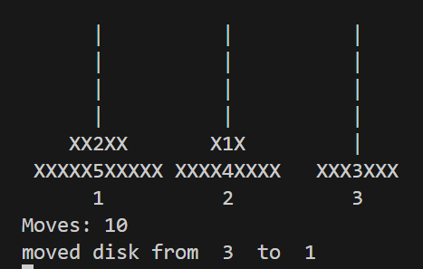

# Build Your Own Tower of Hanoi
This challenge is to build your own version of the classic game tower of hanoi

## The Challenge

The Tower of Hanoi is a mathematical game or puzzle consisting of three rods and a number of disks of various diameters, which can slide onto any rod. The puzzle begins with the disks stacked on one rod in order of decreasing size, the smallest at the top, thus approximating a conical shape. The objective of the puzzle is to move the entire stack to one of the other rods, obeying the following rules:
1. Only one disk may be moved at a time.
1. Each move consists of taking the upper disk from one of the stacks and placing it on top of another stack or on an empty rod.
1. No disk may be placed on top of a disk that is smaller than it.

With three disks, the puzzle can be solved in seven moves. The minimal number of moves required to solve a Tower of Hanoi puzzle is `2^n − 1`, where `n` is the number of disks. 

## Solution
